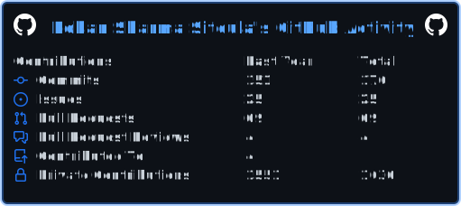

  

# 
I am <b>Rohan<b>

### 
A Tech Enthusiast and Fullstack Developer

---

## My Skill Set
      
### Frontend

  
  
  
  
  
  
  

      
### Backend

  
  
  
  
  
  
  
  
  
  
  

      
### Cloud   

  
  
  
  

---

---

## Connect with me  

  
  
  

